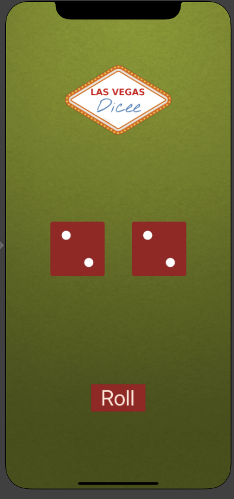

# Auto Layout 

## Goal 
Dicee app currently only looks good on the canvas size that we've chosen. The designs will appear broken if you try to flip the app to landscape or use it on displays with various aspect ratios.

We may specify guidelines for how we want our views to be displayed using Auto Layout. We need these guidelines to instruct the iPhone/iPad on how to arrange all the components in the storyboard onto the display because mobile screens come in a variety of sizes and resolutions. These guidelines enable our UI elements to be resized and placed so that they always seem how the designer intended, regardless of the screen on which they are presented.

## What I Learned

* How to add constraints and understanding how Auto Layout works.
* How to Pin and Align elements.
* How to create containers to configure advanced layouts.
* How to debug auto layout errors.
* Understanding what Xcode needs in order to correctly layout a design.
* How to use Stack Views to create complex interfaces.

# Portrait

# Landscape

